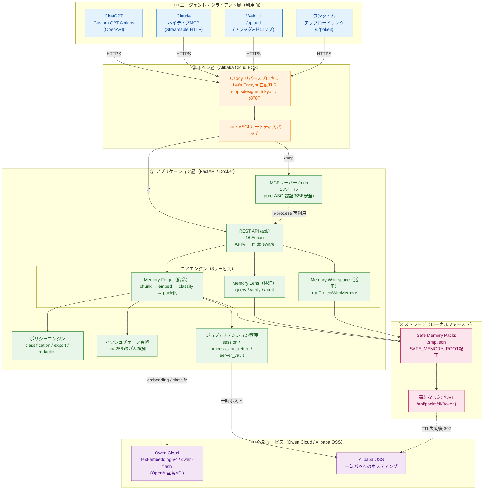
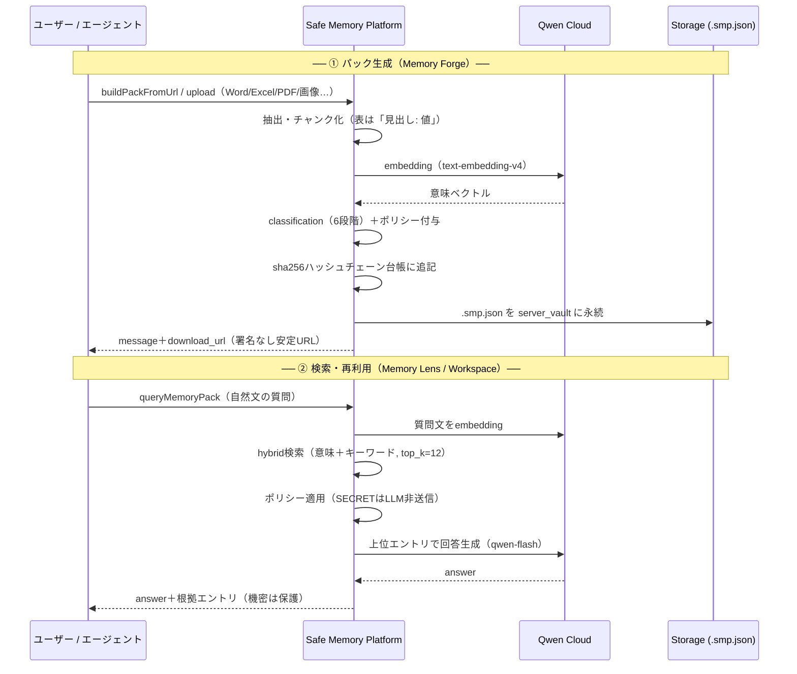
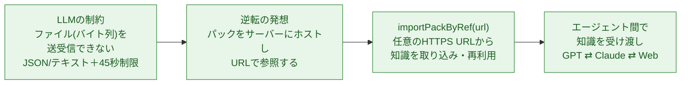
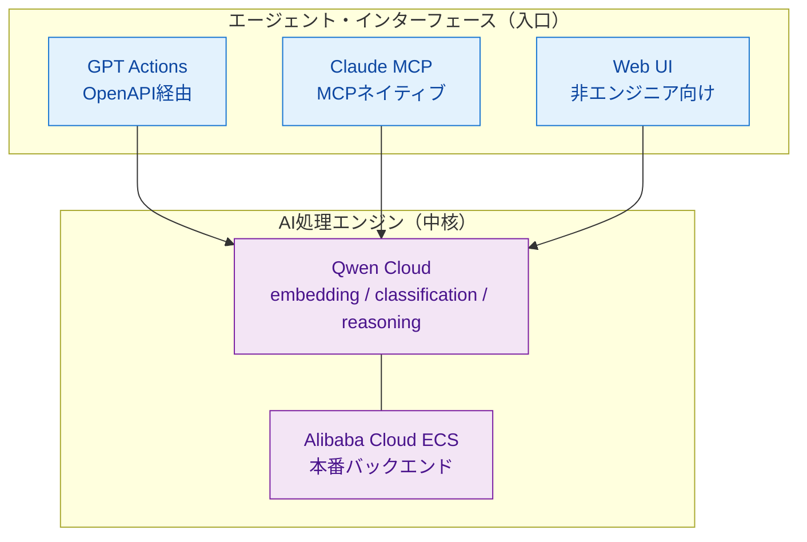

# Safe Memory Platform — アーキテクチャ構成と説明

> **AIエージェントのための、持ち運べる・安全な・再利用可能な「知識ファイル」基盤**
> プライベートなデータ（会計・FX・業務ナレッジ・各種ドキュメント）を、ポリシー付きの
> ポータブルなメモリパック（`.smp.json`）に変換し、**URL経由で** Web・ChatGPT・Claude から
> 共有・再利用できるようにする。

- **本番URL**: https://smp.sdesigner.tokyo （ライブ稼働中）
- **インフラ**: Alibaba Cloud ECS / Docker / Caddy 自動HTTPS / 独自ドメイン
- **AIエンジン**: Qwen Cloud（Alibaba DashScope, OpenAI互換）— embedding / classification / reasoning

---

## 1. システム全体アーキテクチャ

### レイヤー解説

| 層 | 役割 | ポイント |
|---|---|---|
| **① クライアント** | GPT / Claude / Web / ワンタイムリンクの4つの入口 | **同一バックエンドを3面から同一機能で利用**。GPTとClaudeで機能差なし |
| **② エッジ** | Caddyが自動HTTPS＋リバースプロキシ。pure-ASGIで`/mcp`とREST APIを分岐 | `/mcp`を通常のミドルウェアから完全分離し**SSEを壊さない** |
| **③ アプリ** | FastAPI上のコアエンジン（Forge/Lens/Workspace）＋ポリシー＋台帳＋ジョブ | MCPツールは既存RESTハンドラを**in-process再利用**（ロジック二重化なし） |
| **④ 外部** | Qwen Cloudが埋め込み・分類・推論。OSSが一時パックのホスト | **Qwen Cloudが中核AIエンジン**。キー失敗時は決定論的フォールバックで落ちない |
| **⑤ ストレージ** | パックは`.smp.json`としてローカル永続。DB・ベクトルDBなし | 署名なし安定URLで配布、TTL失効後はOSS署名URLへ307 |

---

## 2. データフロー：知識を「パック」にして流通させる

---

## 3. 「URL＝知識の通貨」— なぜこの設計か

LLM（GPT Actions / リモートMCP）は**バイト列を送れない**。この制約を逆手に取り、
**パックをサーバーにホストしURLで参照**する設計に統一した。URLは渡せるので、
**URLが知識流通の「通貨」**になる。プロジェクトが終わっても知識は`.smp.json`として残り、
次のエージェントが `importPackByRef(url)` でそのまま呼び出せる。

---

## 4. Safe Memory Pack（`.smp.json`）の構造

`.smp.json` は「ベクトルDBのクローン」ではなく、**自己完結した知識ファイル**。

| 要素 | 内容 |
|---|---|
| **entries** | 本文（原本）＋ Qwen埋め込み（意味検索用ベクトル）＋ キーワード ＋ メタデータ |
| **classification** | `PUBLIC` / `SHAREABLE` / `INTERNAL` / `CONFIDENTIAL` / `SECRET` / `EPHEMERAL` の6段階 |
| **policy flags** | 「検索に使ってよいか / LLMに送ってよいか / エクスポートしてよいか」 |
| **provenance** | 各エントリの出所（どのファイル由来か） |
| **ledger** | 追記専用のハッシュチェーン（各ブロックが前ブロックのsha256を封入 → 改ざん検知） |

**バックエンドが強制するポリシー**
- `SECRET` は **絶対に** 外部LLMに送信しない
- `CONFIDENTIAL` / `SECRET` は明示許可がない限りエクスポートから除外
- 全ファイルアクセスは `SAFE_MEMORY_ROOT` 配下に閉じ込め（サンドボックス）

---

## 5. 技術スタック

| 分類 | 採用技術 |
|---|---|
| **言語 / FW** | Python 3 / FastAPI / Uvicorn / Pydantic |
| **AIエンジン** | **Qwen Cloud**（Alibaba DashScope, OpenAI互換）— embedding: `text-embedding-v4` / chat: `qwen-flash` |
| **エージェント連携** | ChatGPT Custom GPT Actions（OpenAPI）/ **Claude ネイティブMCP**（Streamable HTTP, `mcp` SDK）/ Web UI |
| **ドキュメント取込** | docx / pptx / pdf（テキスト）/ 画像・スキャンPDF（Tesseract OCR: jpn+eng）/ xlsx / xls / csv |
| **インフラ** | Docker Compose / Alibaba Cloud ECS / Caddy（自動HTTPS）/ 独自ドメイン `sdesigner.tokyo` |
| **ストレージ** | ローカルファースト（DB／ベクトルDBなし）。パックは`.smp.json`。一時ホスティングにAlibaba OSS |
| **セキュリティ** | APIキー認証 / ポリシーエンジン / sha256ハッシュチェーン / サンドボックス / スコープ限定トークン |

---

## 6. ハッカソンでの位置づけ（Qwen Cloud が中核）

> **GPT and Claude are used as agent clients, not as the core AI runtime.**
> The core memory processing pipeline runs on **Alibaba Cloud** and uses **Qwen Cloud**
> for embeddings, classification, reasoning, and safe memory decisions. GPT connects
> through OpenAPI Custom Actions, and Claude connects through the native Remote MCP
> endpoint. This demonstrates that Safe Memory Packs are portable memory assets reusable
> across multiple agent interfaces while still relying on Qwen Cloud as the AI engine.
>
> **操作画面はGPTやClaudeですが、メモリー処理の中核は Alibaba Cloud 上のバックエンドと Qwen Cloud です。**

---

*本番: https://smp.sdesigner.tokyo ・ GPTスキーマ: /openapi.json ・ Claude MCP: /mcp ・ ヘルス: /health*
